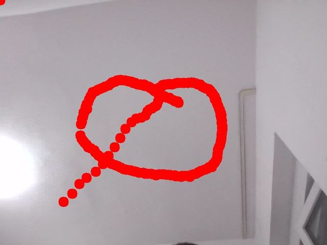
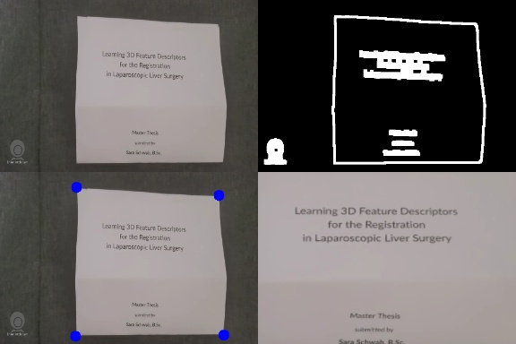

# opencv_beginner
sources: https://github.com/murtazahassan/Learn-OpenCV-in-3-hours/edit/master/README.md

|        Virtual Painter         |        Document Scanner        |      Number Plate Detector      |
|:------------------------------:|:------------------------------:|:-------------------------------:|
|  |  |  |

# Using Another Device as Your Camera

Sometimes, using your phone as an additional camera can be quite convenient. Here's how you can set it up:

## Android:

1. **Download the App:** Get the **[Iriun Webcam](https://iriun.com/)** app from the Play Store.
2. **Connect via USB:** Connect your phone to your computer using a USB cable.
3. **Enable Developer Options:**
   - Open Settings on your phone.
   - Navigate to "About phone" or "Software information".
   - Tap on "Build number" multiple times (usually 5 times) to enable Developer Options.
4. **Enable USB Debugging:**
   - In Developer Options, find and enable "USB debugging".
5. **Launch the App:** Open the **[Iriun Webcam](https://iriun.com/)** app on your phone.

## Linux:

1. **Download the App:** Obtain the **[Iriun Webcam](https://iriun.com/)** app from the official website.
2. **Install ADB:** If you haven't already, install ADB (Android Debug Bridge) on your Linux machine: `sudo apt install adb`.
3. **Start ADB Server:**
   - Launch the ADB server by running: `sudo adb devices`.
   - To stop the ADB server, use: `sudo adb kill-server`.
4. **Launch the App:** Open the **[Iriun Webcam](https://iriun.com/)** app on your phone.

To identify your computer's webcam device, you can use the following command in your terminal:

```bash
cd /dev
ls -l | grep video

This command will display the available video devices, typically named /dev/video0, /dev/video1, or /dev/video2.