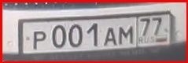

# opencv_beginner
sources: https://github.com/murtazahassan/Learn-OpenCV-in-3-hours/edit/master/README.md

|        Virtual Painter         |        Document Scanner        |      Number Plate Detector      |
|:------------------------------:|:------------------------------:|:-------------------------------:|
|    |    |   |
